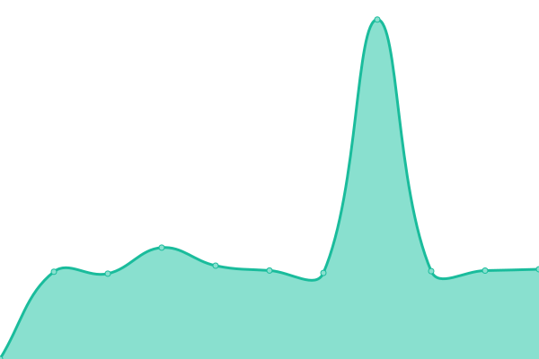
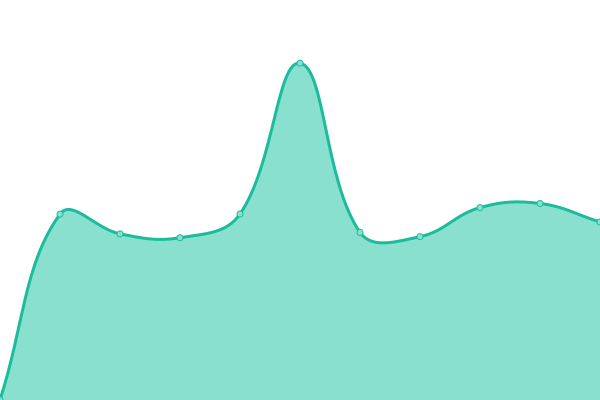
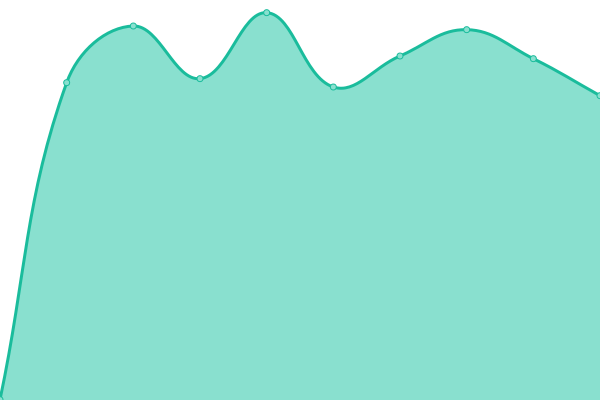
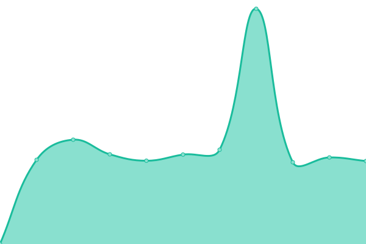
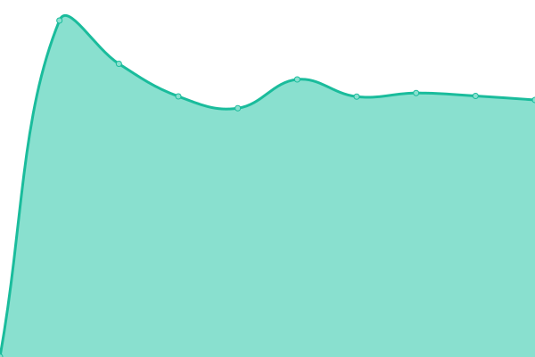

# [📈 Live Status](https://avioli.github.io/ionata.com.au-uptime/): <!--live status--> **🟩 All systems operational**

This repository contains the open-source uptime monitor and status page for [Upptime](https://upptime.js.org), powered by [Upptime](https://github.com/upptime/upptime).

With [Upptime](https://upptime.js.org), you can get your own unlimited and free uptime monitor and status page, powered entirely by a GitHub repository. We use [Issues](https://github.com/upptime/upptime/issues) as incident reports, [Actions](https://github.com/upptime/upptime/actions) as uptime monitors, and [Pages](https://avioli.github.io/ionata.com.au-uptime/) for the status page.

<!--start: status pages-->
<!-- This summary is generated by Upptime (https://github.com/upptime/upptime) -->
<!-- Do not edit this manually, your changes will be overwritten -->

| URL                                                                             | Status | History                                                                                                                                                              | Response Time                                                                                                  | Uptime                                                                                                                                                                                                                                                                                                     |
| ------------------------------------------------------------------------------- | ------ | -------------------------------------------------------------------------------------------------------------------------------------------------------------------- | -------------------------------------------------------------------------------------------------------------- | ---------------------------------------------------------------------------------------------------------------------------------------------------------------------------------------------------------------------------------------------------------------------------------------------------------- |
| [Ionata](https://ionata.com.au)                                                 | 🟩 Up  | [ionata.yml](https://github.com/avioli/ionata.com.au-uptime/commits/master/history/ionata.yml)                                                                       |  939ms                                    |                                                                        |
| [Gowans Auctions](https://www.gowansauctions.com.au/)                           | 🟩 Up  | [gowans-auctions.yml](https://github.com/avioli/ionata.com.au-uptime/commits/master/history/gowans-auctions.yml)                                                     |  1137ms                          |                                                      |
| [Wildtracker](https://www.wildtracker.com.au/)                                  | 🟩 Up  | [wildtracker.yml](https://github.com/avioli/ionata.com.au-uptime/commits/master/history/wildtracker.yml)                                                             |  668ms                               |                                                              |
| [The Friends' School](https://www.friends.tas.edu.au/)                          | 🟩 Up  | [the-friends-school.yml](https://github.com/avioli/ionata.com.au-uptime/commits/master/history/the-friends-school.yml)                                               |  1808ms                       |                                                |
| [Women with Disabilities Australia (WWDA)](https://wwda.org.au/)                | 🟩 Up  | [women-with-disabilities-australia-wwda.yml](https://github.com/avioli/ionata.com.au-uptime/commits/master/history/women-with-disabilities-australia-wwda.yml)       |  912ms    |        |
| [The Cat Clinic](https://www.catvethobart.com.au/)                              | 🟩 Up  | [the-cat-clinic.yml](https://github.com/avioli/ionata.com.au-uptime/commits/master/history/the-cat-clinic.yml)                                                       |  1005ms                           |                                                        |
| [Huon Valley Council](https://www.huonvalleytas.com/)                           | 🟩 Up  | [huon-valley-council.yml](https://github.com/avioli/ionata.com.au-uptime/commits/master/history/huon-valley-council.yml)                                             |  1121ms                      |                                              |
| [The Human Practice](https://www.thehumanpractice.com/)                         | 🟩 Up  | [the-human-practice.yml](https://github.com/avioli/ionata.com.au-uptime/commits/master/history/the-human-practice.yml)                                               |  881ms                        |                                                |
| [Premier Travel Tasmania](https://www.premiertraveltasmania.com/)               | 🟩 Up  | [premier-travel-tasmania.yml](https://github.com/avioli/ionata.com.au-uptime/commits/master/history/premier-travel-tasmania.yml)                                     |  986ms                   |                                      |
| [Work & Training](https://www.workandtraining.com.au/)                          | 🟩 Up  | [work-and-training.yml](https://github.com/avioli/ionata.com.au-uptime/commits/master/history/work-and-training.yml)                                                 |  1308ms                        |                                                  |
| [Disaster Resilience Education Tasmania](https://disasterresiliencetas.com.au/) | 🟩 Up  | [disaster-resilience-education-tasmania.yml](https://github.com/avioli/ionata.com.au-uptime/commits/master/history/disaster-resilience-education-tasmania.yml)       |  853ms    |        |
| [Mount Carmel](https://mountcarmel.tas.edu.au/)                                 | 🟩 Up  | [mount-carmel.yml](https://github.com/avioli/ionata.com.au-uptime/commits/master/history/mount-carmel.yml)                                                           |  1216ms                             |                                                            |
| [Devine Property](https://www.devineproperty.com.au/)                           | 🟩 Up  | [devine-property.yml](https://github.com/avioli/ionata.com.au-uptime/commits/master/history/devine-property.yml)                                                     |  1056ms                          |                                                      |
| [Inspiring Tasmania](https://inspiringtas.org.au/)                              | 🟩 Up  | [inspiring-tasmania.yml](https://github.com/avioli/ionata.com.au-uptime/commits/master/history/inspiring-tasmania.yml)                                               |  889ms                        |                                                |
| [Riverfront Motel + Villas](https://riverfronthobart.com/)                      | 🟩 Up  | [riverfront-motel-villas.yml](https://github.com/avioli/ionata.com.au-uptime/commits/master/history/riverfront-motel-villas.yml)                                     |  850ms                   |                                      |
| [MEDDLE](https://meddle-scor149.org/)                                           | 🟩 Up  | [meddle.yml](https://github.com/avioli/ionata.com.au-uptime/commits/master/history/meddle.yml)                                                                       |  1651ms                                   |                                                                        |
| [New Horizons Preschool](https://newhorizonspreschool.com.au/)                  | 🟩 Up  | [new-horizons-preschool.yml](https://github.com/avioli/ionata.com.au-uptime/commits/master/history/new-horizons-preschool.yml)                                       |  869ms                    |                                        |
| [SES Tasmania](https://www.ses.tas.gov.au/)                                     | 🟩 Up  | [ses-tasmania.yml](https://github.com/avioli/ionata.com.au-uptime/commits/master/history/ses-tasmania.yml)                                                           |  1789ms                             |                                                            |
| [The Orb](https://www.theorb.tas.gov.au/)                                       | 🟩 Up  | [the-orb.yml](https://github.com/avioli/ionata.com.au-uptime/commits/master/history/the-orb.yml)                                                                     |  1016ms                                  |                                                                      |
| [gulliver.](https://gogulliver.co/)                                             | 🟩 Up  | [gulliver.yml](https://github.com/avioli/ionata.com.au-uptime/commits/master/history/gulliver.yml)                                                                   |  850ms                                  |                                                                    |
| [Huon Aquaculture](https://www.huonaqua.com.au/)                                | 🟩 Up  | [huon-aquaculture.yml](https://github.com/avioli/ionata.com.au-uptime/commits/master/history/huon-aquaculture.yml)                                                   |  1197ms                         |                                                    |
| [Petrusma Property](https://www.petrusma.com.au/)                               | 🟩 Up  | [petrusma-property.yml](https://github.com/avioli/ionata.com.au-uptime/commits/master/history/petrusma-property.yml)                                                 |  1260ms                        |                                                  |
| [Huon Aquaculture Sustainability Dashboard](https://dashboard.huonaqua.com.au/) | 🟩 Up  | [huon-aquaculture-sustainability-dashboard.yml](https://github.com/avioli/ionata.com.au-uptime/commits/master/history/huon-aquaculture-sustainability-dashboard.yml) |  561ms |  |
| [Port Arthur Historic Sites](https://portarthur.org.au/)                        | 🟩 Up  | [port-arthur-historic-sites.yml](https://github.com/avioli/ionata.com.au-uptime/commits/master/history/port-arthur-historic-sites.yml)                               |  1373ms               |                                |
| [Tasmania Police Recruitment](https://recruitment.police.tas.gov.au/)           | 🟩 Up  | [tasmania-police-recruitment.yml](https://github.com/avioli/ionata.com.au-uptime/commits/master/history/tasmania-police-recruitment.yml)                             |  1156ms              |                              |
| [Tasmanian Arts Guide](https://tasmanianartsguide.com.au/)                      | 🟩 Up  | [tasmanian-arts-guide.yml](https://github.com/avioli/ionata.com.au-uptime/commits/master/history/tasmanian-arts-guide.yml)                                           |  1168ms                     |                                            |
| [TasTAFE](https://www.tastafe.tas.edu.au/)                                      | 🟩 Up  | [tas-tafe.yml](https://github.com/avioli/ionata.com.au-uptime/commits/master/history/tas-tafe.yml)                                                                   |  1927ms                                 |                                                                    |

<!--end: status pages-->

[**Visit our status website →**](https://avioli.github.io/ionata.com.au-uptime/)

## 📄 License

- Code: [MIT](./LICENSE) © [Upptime](https://upptime.js.org)
- Data in the `./history` directory: [Open Database License](https://opendatacommons.org/licenses/odbl/1-0/)
