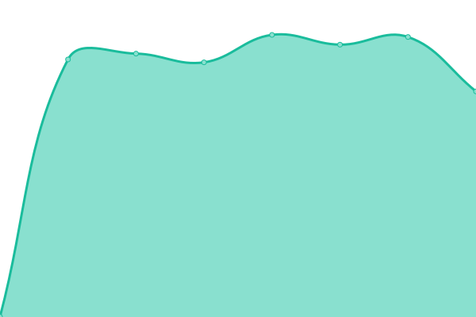
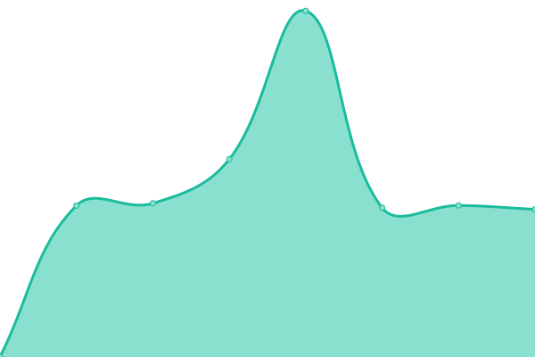

# [📈 Live Status](https://avioli.github.io/ionata.com.au-uptime/): <!--live status--> **🟩 All systems operational**

This repository contains the open-source uptime monitor and status page for [Upptime](https://upptime.js.org), powered by [Upptime](https://github.com/upptime/upptime).

With [Upptime](https://upptime.js.org), you can get your own unlimited and free uptime monitor and status page, powered entirely by a GitHub repository. We use [Issues](https://github.com/upptime/upptime/issues) as incident reports, [Actions](https://github.com/upptime/upptime/actions) as uptime monitors, and [Pages](https://avioli.github.io/ionata.com.au-uptime/) for the status page.

<!--start: status pages-->
<!-- This summary is generated by Upptime (https://github.com/upptime/upptime) -->
<!-- Do not edit this manually, your changes will be overwritten -->
<!-- prettier-ignore -->
| URL | Status | History | Response Time | Uptime |
| --- | ------ | ------- | ------------- | ------ |
|  [Ionata](https://ionata.com.au) | 🟩 Up | [ionata.yml](https://github.com/avioli/ionata.com.au-uptime/commits/master/history/ionata.yml) | 

 1017ms
     
 | 

<a href="https://avioli.github.io/ionata.com.au-uptime/history/ionata">100.00%</a>
    

|  [Gowans Auctions](https://www.gowansauctions.com.au/) | 🟩 Up | [gowans-auctions.yml](https://github.com/avioli/ionata.com.au-uptime/commits/master/history/gowans-auctions.yml) | 

 1310ms
     
 | 

<a href="https://avioli.github.io/ionata.com.au-uptime/history/gowans-auctions">100.00%</a>
    

|  [Wildtracker](https://www.wildtracker.com.au/) | 🟩 Up | [wildtracker.yml](https://github.com/avioli/ionata.com.au-uptime/commits/master/history/wildtracker.yml) | 

 758ms
     
 | 

<a href="https://avioli.github.io/ionata.com.au-uptime/history/wildtracker">100.00%</a>
    

|  [The Friends' School](https://www.friends.tas.edu.au/) | 🟩 Up | [the-friends-school.yml](https://github.com/avioli/ionata.com.au-uptime/commits/master/history/the-friends-school.yml) | 

 1662ms
     
 | 

<a href="https://avioli.github.io/ionata.com.au-uptime/history/the-friends-school">100.00%</a>
    

|  [Women with Disabilities Australia (WWDA)](https://wwda.org.au/) | 🟩 Up | [women-with-disabilities-australia-wwda.yml](https://github.com/avioli/ionata.com.au-uptime/commits/master/history/women-with-disabilities-australia-wwda.yml) | 

 993ms
     
 | 

<a href="https://avioli.github.io/ionata.com.au-uptime/history/women-with-disabilities-australia-wwda">100.00%</a>
    

|  [The Cat Clinic](https://www.catvethobart.com.au/) | 🟩 Up | [the-cat-clinic.yml](https://github.com/avioli/ionata.com.au-uptime/commits/master/history/the-cat-clinic.yml) | 

 1283ms
     
 | 

<a href="https://avioli.github.io/ionata.com.au-uptime/history/the-cat-clinic">100.00%</a>
    

|  [Huon Valley Council](https://www.huonvalleytas.com/) | 🟩 Up | [huon-valley-council.yml](https://github.com/avioli/ionata.com.au-uptime/commits/master/history/huon-valley-council.yml) | 

 1271ms
     
 | 

<a href="https://avioli.github.io/ionata.com.au-uptime/history/huon-valley-council">100.00%</a>
    

|  [The Human Practice](https://www.thehumanpractice.com/) | 🟩 Up | [the-human-practice.yml](https://github.com/avioli/ionata.com.au-uptime/commits/master/history/the-human-practice.yml) | 

 947ms
     
 | 

<a href="https://avioli.github.io/ionata.com.au-uptime/history/the-human-practice">100.00%</a>
    

|  [Premier Travel Tasmania](https://www.premiertraveltasmania.com/) | 🟩 Up | [premier-travel-tasmania.yml](https://github.com/avioli/ionata.com.au-uptime/commits/master/history/premier-travel-tasmania.yml) | 

 1060ms
     
 | 

<a href="https://avioli.github.io/ionata.com.au-uptime/history/premier-travel-tasmania">100.00%</a>
    

|  [Work & Training](https://www.workandtraining.com.au/) | 🟩 Up | [work-and-training.yml](https://github.com/avioli/ionata.com.au-uptime/commits/master/history/work-and-training.yml) | 

 1907ms
     
 | 

<a href="https://avioli.github.io/ionata.com.au-uptime/history/work-and-training">99.35%</a>
    

|  [Disaster Resilience Education Tasmania](https://disasterresiliencetas.com.au/) | 🟩 Up | [disaster-resilience-education-tasmania.yml](https://github.com/avioli/ionata.com.au-uptime/commits/master/history/disaster-resilience-education-tasmania.yml) | 

 916ms
     
 | 

<a href="https://avioli.github.io/ionata.com.au-uptime/history/disaster-resilience-education-tasmania">100.00%</a>
    

|  [Mount Carmel](https://mountcarmel.tas.edu.au/) | 🟩 Up | [mount-carmel.yml](https://github.com/avioli/ionata.com.au-uptime/commits/master/history/mount-carmel.yml) | 

 1453ms
     
 | 

<a href="https://avioli.github.io/ionata.com.au-uptime/history/mount-carmel">100.00%</a>
    

|  [Devine Property](https://www.devineproperty.com.au/) | 🟩 Up | [devine-property.yml](https://github.com/avioli/ionata.com.au-uptime/commits/master/history/devine-property.yml) | 

 1105ms
     
 | 

<a href="https://avioli.github.io/ionata.com.au-uptime/history/devine-property">100.00%</a>
    

|  [Inspiring Tasmania](https://inspiringtas.org.au/) | 🟩 Up | [inspiring-tasmania.yml](https://github.com/avioli/ionata.com.au-uptime/commits/master/history/inspiring-tasmania.yml) | 

 1031ms
     
 | 

<a href="https://avioli.github.io/ionata.com.au-uptime/history/inspiring-tasmania">100.00%</a>
    

|  [Riverfront Motel + Villas](https://riverfronthobart.com/) | 🟩 Up | [riverfront-motel-villas.yml](https://github.com/avioli/ionata.com.au-uptime/commits/master/history/riverfront-motel-villas.yml) | 

 979ms
     
 | 

<a href="https://avioli.github.io/ionata.com.au-uptime/history/riverfront-motel-villas">100.00%</a>
    

|  [MEDDLE](https://meddle-scor149.org/) | 🟩 Up | [meddle.yml](https://github.com/avioli/ionata.com.au-uptime/commits/master/history/meddle.yml) | 

 1733ms
     
 | 

<a href="https://avioli.github.io/ionata.com.au-uptime/history/meddle">100.00%</a>
    

|  [New Horizons Preschool](https://newhorizonspreschool.com.au/) | 🟩 Up | [new-horizons-preschool.yml](https://github.com/avioli/ionata.com.au-uptime/commits/master/history/new-horizons-preschool.yml) | 

 1005ms
     
 | 

<a href="https://avioli.github.io/ionata.com.au-uptime/history/new-horizons-preschool">100.00%</a>
    

|  [SES Tasmania](https://www.ses.tas.gov.au/) | 🟩 Up | [ses-tasmania.yml](https://github.com/avioli/ionata.com.au-uptime/commits/master/history/ses-tasmania.yml) | 

 1850ms
     
 | 

<a href="https://avioli.github.io/ionata.com.au-uptime/history/ses-tasmania">100.00%</a>
    

|  [The Orb](https://www.theorb.tas.gov.au/) | 🟩 Up | [the-orb.yml](https://github.com/avioli/ionata.com.au-uptime/commits/master/history/the-orb.yml) | 

 1161ms
     
 | 

<a href="https://avioli.github.io/ionata.com.au-uptime/history/the-orb">100.00%</a>
    

|  [gulliver.](https://gogulliver.co/) | 🟩 Up | [gulliver.yml](https://github.com/avioli/ionata.com.au-uptime/commits/master/history/gulliver.yml) | 

 935ms
     
 | 

<a href="https://avioli.github.io/ionata.com.au-uptime/history/gulliver">100.00%</a>
    

|  [Huon Aquaculture](https://www.huonaqua.com.au/) | 🟩 Up | [huon-aquaculture.yml](https://github.com/avioli/ionata.com.au-uptime/commits/master/history/huon-aquaculture.yml) | 

 1545ms
     
 | 

<a href="https://avioli.github.io/ionata.com.au-uptime/history/huon-aquaculture">100.00%</a>
    

|  [Petrusma Property](https://www.petrusma.com.au/) | 🟩 Up | [petrusma-property.yml](https://github.com/avioli/ionata.com.au-uptime/commits/master/history/petrusma-property.yml) | 

 1430ms
     
 | 

<a href="https://avioli.github.io/ionata.com.au-uptime/history/petrusma-property">100.00%</a>
    

|  [Huon Aquaculture Sustainability Dashboard](https://dashboard.huonaqua.com.au/) | 🟩 Up | [huon-aquaculture-sustainability-dashboard.yml](https://github.com/avioli/ionata.com.au-uptime/commits/master/history/huon-aquaculture-sustainability-dashboard.yml) | 

 663ms
     
 | 

<a href="https://avioli.github.io/ionata.com.au-uptime/history/huon-aquaculture-sustainability-dashboard">100.00%</a>
    

|  [Port Arthur Historic Sites](https://portarthur.org.au/) | 🟩 Up | [port-arthur-historic-sites.yml](https://github.com/avioli/ionata.com.au-uptime/commits/master/history/port-arthur-historic-sites.yml) | 

 1647ms
     
 | 

<a href="https://avioli.github.io/ionata.com.au-uptime/history/port-arthur-historic-sites">100.00%</a>
    

|  [Tasmania Police Recruitment](https://recruitment.police.tas.gov.au/) | 🟩 Up | [tasmania-police-recruitment.yml](https://github.com/avioli/ionata.com.au-uptime/commits/master/history/tasmania-police-recruitment.yml) | 

 1293ms
     
 | 

<a href="https://avioli.github.io/ionata.com.au-uptime/history/tasmania-police-recruitment">100.00%</a>
    

|  [Tasmanian Arts Guide](https://tasmanianartsguide.com.au/) | 🟩 Up | [tasmanian-arts-guide.yml](https://github.com/avioli/ionata.com.au-uptime/commits/master/history/tasmanian-arts-guide.yml) | 

 1301ms
     
 | 

<a href="https://avioli.github.io/ionata.com.au-uptime/history/tasmanian-arts-guide">99.85%</a>
    

|  [TasTAFE](https://www.tastafe.tas.edu.au/) | 🟩 Up | [tas-tafe.yml](https://github.com/avioli/ionata.com.au-uptime/commits/master/history/tas-tafe.yml) | 

 2175ms
     
 | 

<a href="https://avioli.github.io/ionata.com.au-uptime/history/tas-tafe">100.00%</a>
    

<!--end: status pages-->

[**Visit our status website →**](https://avioli.github.io/ionata.com.au-uptime/)

## 📄 License

- Code: [MIT](./LICENSE) © [Upptime](https://upptime.js.org)
- Data in the `./history` directory: [Open Database License](https://opendatacommons.org/licenses/odbl/1-0/)
